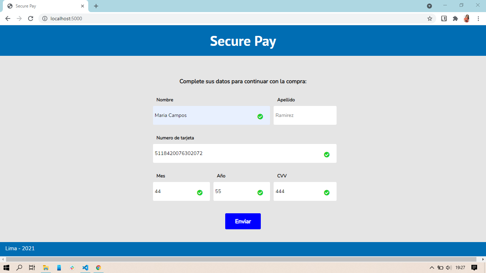
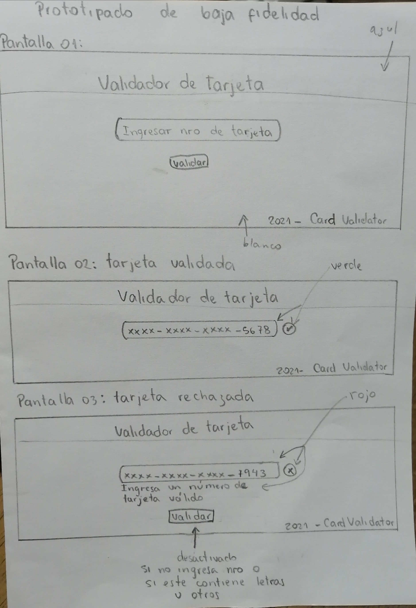
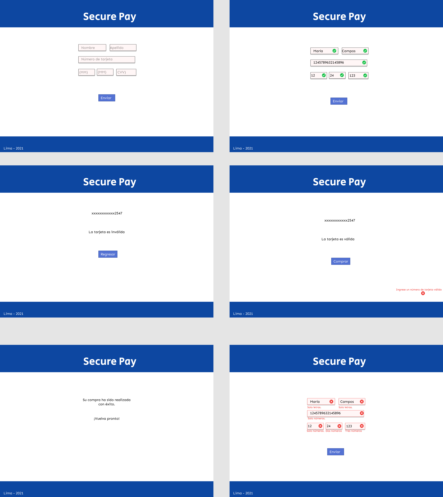

# Secure Pay

## Índice

* [1. Resumen del proyecto](#1-resumen-del-proyecto)
* [2. UX](#2-u-x)
* [3. Plan de acción](#3-plan-de-acción)

***

## 1. Resumen del proyecto

Secure Pay es una pasarela de pago donde el usuario podrá terminar su compra al validar sus datos, principalmente el numero de la tarjeta que es validado mediante el algoritmo de luhn.

***

## 2. UX

Los usuarios de Secure Pay son clientes de una tienda online que decidió agregar el modulo de pago virtual. El objetivo es mejorar la experiencia del usuario haciendo que el proceso de pago sea más fácil.
Secure Pay brinda la seguridad tanto para la tienda como para el usuario, al validar las tarjetas con el algoritmo de luhn evitamos fraude, y por otro lado la interfaz es intuitiva para el usuario.

### Primer prototipo

Decidí mejorar el formulario dividiendo la fecha de vencimiento de la tarjeta en mes y año, a la vez agregar alertas cuando los caracteres ingresados sean distintos a lo que se pide. También se agregaron tres pantallas, una que permita regresar al formulario en caso de que la tarjeta sea inválida, la siguiente pantallla cuando sea válida y muestre la tarjeta enmascarada, la franquicia y un botón para terminar con la compra, la última pantalla es un mensaje de compra exitosa.

### Prototipo final

***

## 3. Plan de acción

- Crear prototipos e iterar.
- HTML semántico.
- Pseudocódigo de algoritmo de Luhn y  en papel, para luego realizarlo en validator.js con uso de bucles y condicionales.
- Uso de funciones.
- Exportar e importar métodos
- Testeo unitario.
- Uso de DOM: manejo de eventos y manipulación dinámica.
- Uso de comandos git.
- Uso de selectores CSS.
- Hacker edition
